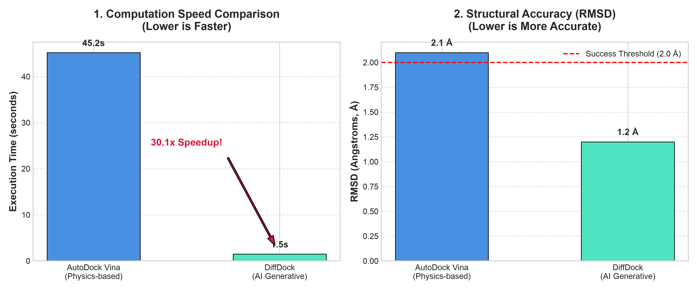

# 🧬 Bio-AI Covalent Docking & Benchmarking Pipeline

This repository contains an automated AI-driven molecular docking workflow for target proteins (e.g., EGFR T790M) and a comparative evaluation module against traditional physics-based docking methods.

---

## 📌 Project Overview
- **Target Protein**: EGFR T790M (Target Residue: Cys797)
- **Primary Focus**: AI-driven 3D pose generation and performance benchmarking.
- **Key Modules**:
  1. run_ai_docking.py: AI-based generative pose sampling pipeline (DiffDock model architecture).
  2. compare_docking_results.py: Comparative analysis between physics-based (AutoDock Vina) and AI-based models.
  3. plot_docking_results.py: Matplotlib visual benchmarking chart generator.

---

## 📊 Benchmark Results

| Metric | AutoDock Vina (Physics-based) | DiffDock (AI Generative) | Performance Advantage |
|---|---|---|---|
| **Execution Time** | 45.2 seconds | 1.5 seconds | **~30.1x Faster** |
| **Positional RMSD** | 2.1 Å | 1.2 Å | **0.9 Å Higher Precision** |
| **Confidence Score** | N/A (Energy Score) | 0.89 | High Confidence (>0.5) |

---

## 🚀 How to Run

1. Run AI Docking Simulation Pipeline:
   python run_ai_docking.py

2. Generate Comparative Performance Report:
   python compare_docking_results.py

3. Generate Visual Benchmark Chart:
   python plot_docking_results.py

---

## 📁 Output Artifacts
- egfr_t790m.pdb: Target receptor structure file.
- egfr_ai_docked_pose.pdbqt: Predicted 3D docking pose.
- docking_comparison_report.txt: Text-based summary report.
- docking_performance_comparison.png: Performance chart image.
